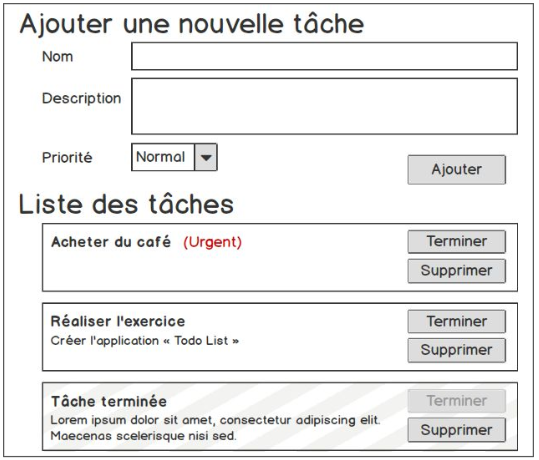

# Exercice 4
## Créer une Todo List
1. Constitué des éléments suivants :
   - Un formulaire pour ajouter une nouvelle tâche à effectuer
   - Une liste de tâches, qui permet les actions suivantes :
     - Terminer une tâche
     - Supprimer une tâche
2. Une tâche contient les informations suivantes :
   - Un nom ( Obligatoire ) et une description ( Optionnel )
   - Une priorité ( Basse / Normal / Urgent )
   - Une complétion ( Une valeur booléen )
3. Ajouter une validation au formulaire
   - Champs manquants en rouge
4. Ajouter de la couleur aux tâches
   - Urgente en rouge
   - Terminée en gris (Rayure diagonal)
5. (BONUS) Ajouter des filtres à la liste
   - En cours
   - Urgentes
   - Terminées
- Mockup du rendu à obtenir
  